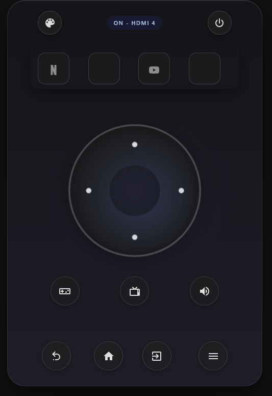

# TV Control Card

🌐 [Versión en español](README.md)

A minimalist custom card to control LG WebOS and Samsung TVs in Home Assistant.

[](https://github.com/extraiotpruebas/minimalist-tv-control-card)
[](https://github.com/custom-components/hacs)



---

## Features

- **Adaptive Design**: Dynamic visual themes that change based on the active source (Netflix, YouTube, Prime Video, Disney+)
- **Multi-brand Support**: Compatible with LG WebOS and Samsung (Tizen)
- **Configurable Control Modes**: 3 customizable slots to choose which modes appear on the mode wheel
- **Custom Modes**: Up to 3 fully customizable modes with custom icons and actions
- **Customizable Exit Button**: Icon and action configurable from the UI editor or YAML
- **Script Support**: Buttons can execute Home Assistant scripts
- **Source Support**: Direct switching to HDMI or other input sources
- **Virtual Touchpad**: Directional control with configurable buttons per mode
- **Streaming Shortcuts**: Quick access buttons for streaming services (Netflix, Disney+, YouTube, Prime Video)
- **Status Indicators**: TV state and active source display
- **UI Editor**: Visual configuration integrated in the Lovelace editor
- **Haptic Feedback**: Vibration on mobile devices when pressing buttons

---

## Screenshots

| | | | |
|---|---|---|---|
|  |  |  |  |

---

## Requirements

- Home Assistant 2021.12.0 or higher
- [HACS](https://hacs.xyz/) installed
- **LG WebOS TV** integration (for LG TVs) — available natively in Home Assistant
- **[SamsungTV Smart](https://github.com/ollo69/ha-samsungtv-smart)** integration (for Samsung TVs) — installation via HACS required
- **[Custom Brand Icons](https://github.com/elax46/custom-brand-icons)** — required for streaming icons (Netflix, Disney+, Prime Video)

---

## Installation

### Via HACS (Recommended)

1. Open HACS in your Home Assistant instance
2. Go to **Frontend**
3. Click the three-dot menu → **Custom repositories**
4. Add `https://github.com/extraiotpruebas/minimalist-tv-control-card` as a repository
5. Select **Lovelace** as the category
6. Search for **TV Control Card** and click **Install**
7. Restart Home Assistant

### Manual

1. Download `minimalist-tv-control-card.js`
2. Copy it to `/config/www/`
3. Add the resource in your Lovelace configuration:

```yaml
resources:
  - url: /local/minimalist-tv-control-card.js
    type: module
```

---

## Configuration

### Minimal Configuration

```yaml
type: custom:tv-control-card
entity: media_player.my_tv
```

### Full Configuration

```yaml
type: custom:tv-control-card
entity: media_player.my_tv
colorMode: dark
modelConfig: samsung
mode_slot_1: navegacion
mode_slot_2: busqueda
mode_slot_3: audio
```

---

## Configuration Parameters

| Parameter | Type | Required | Default | Description |
|---|---|---|---|---|
| `entity` | string | **Yes** | — | `media_player` entity ID |
| `colorMode` | string | No | `dark` | Default theme: `dark` or `light` |
| `modelConfig` | string | No | `LG TV` | TV brand: `LG TV` or `samsung` |
| `control_mode_entity` | string | No | — | `input_select` entity to sync the active mode |
| `mode_slot_1` | string | No | `navegacion` | Mode assigned to wheel slot 1 |
| `mode_slot_2` | string | No | `busqueda` | Mode assigned to wheel slot 2 |
| `mode_slot_3` | string | No | `audio` | Mode assigned to wheel slot 3 |
| `exit_icon` | string | No | `mdi:lock-alert` | Exit button icon |
| `exit_type` | string | No | `button` | Exit button action type: `button`, `command`, `script` |
| `exit_value` | string | No | `EXIT` / `KEY_EXIT` | Exit button action |

---

## Available Modes

### Default Modes

| ID | Description | Touchpad Buttons |
|---|---|---|
| `navegacion` | General navigation | Home, Menu, Exit, Back |
| `busqueda` | Channel control | Channel Up/Down, Info, Guide |
| `audio` | Volume control | Volume Up/Down, Mute, Sound |

### Custom Modes

Up to 3 fully customizable modes. Each mode allows you to define:
- Icon for the mode wheel button
- Mode name
- Icon and action for each direction (up, down, left, right)
- Action type: `button` (remote control command), `command` (WebOS endpoint), `script` (HA script)

| ID | Description |
|---|---|
| `custom1` | Custom mode 1 |
| `custom2` | Custom mode 2 |
| `custom3` | Custom mode 3 |

#### YAML example for a custom mode:

```yaml
type: custom:tv-control-card
entity: media_player.my_tv
mode_slot_1: custom1
custom1_mode_icon: mdi:home-sound-in
custom1_label: Amplifier
custom1_up_icon: mdi:volume-plus
custom1_up_type: script
custom1_up_value: script.volume_up_amp
custom1_down_icon: mdi:volume-minus
custom1_down_type: script
custom1_down_value: script.volume_down_amp
custom1_left_icon: mdi:power
custom1_left_type: button
custom1_left_value: MUTE
custom1_right_icon: mdi:surround-sound
custom1_right_type: button
custom1_right_value: ASTERISK
```

### Additional Modes

| ID | Description | Touchpad Buttons |
|---|---|---|
| `fuentes` | Input selection | HDMI 1, 2, 3, 4 |
| `info` | Information | Guide, Info, My Apps, Active App Info |
| `text` | Text controls | Send text, On-screen keyboard, Delete |

---

## Themes

The card automatically adapts its appearance based on the active source:

| Source | Theme |
|---|---|
| Netflix | Dark red |
| Disney+ | Navy blue |
| Prime Video | Teal blue |
| Default | Dark neutral (or light if `colorMode: light`) |

---

## Exit Button

The exit button (top left corner) is fully customizable:

```yaml
# Run a script when pressing exit
exit_icon: mdi:shield-home
exit_type: script
exit_value: script.activate_alarm

# Send a remote control button
exit_icon: mdi:television-off
exit_type: button
exit_value: EXIT
```

---

## Project Structure

```
minimalist-tv-control-card/
├── minimalist-tv-control-card.js  # Main file
├── README.md                       # Documentation (Spanish)
├── README.en.md                    # Documentation (English)
├── hacs.json                       # HACS configuration
├── info.md                         # Short info for HACS
└── .github/
    └── workflows/
        └── validate.yaml
```

---

## Troubleshooting

**Card doesn't appear**
1. Verify the file is in `/config/www/`
2. Make sure you added the resource in Lovelace
3. Clear browser cache (Ctrl + F5)
4. Check the browser console for errors

**Buttons don't work**
1. Verify your TV is on and reachable on the network
2. Confirm the LG WebOS or SamsungTV Smart integration is correctly configured
3. Verify `modelConfig` is set correctly (`LG TV` or `samsung`)

**Streaming icons don't appear**
1. Verify Custom Brand Icons is installed and active

**Theme doesn't change**
The card automatically detects the theme from the `source` attribute of your `media_player` entity. Verify your TV correctly reports the active source.

---

## Contributing

1. Fork the repository
2. Create a branch: `git checkout -b feature/NewFeature`
3. Commit: `git commit -m 'feat: description'`
4. Push: `git push origin feature/NewFeature`
5. Open a Pull Request

---

## License

MIT — see [LICENSE](LICENSE) for details.

---

Developed with ❤️ for the Home Assistant community

> This is an unofficial custom card, not affiliated with LG Electronics or Samsung Electronics.
